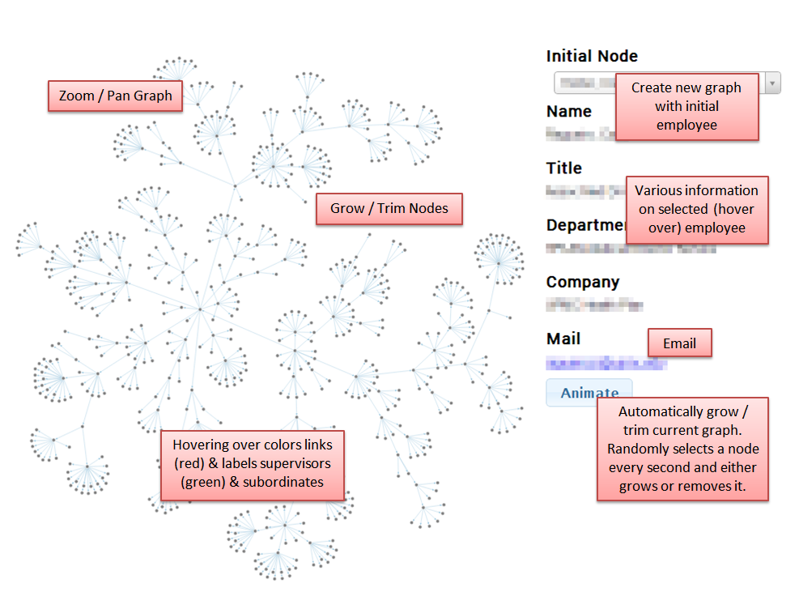

# D3.js Organization Chart
This is a simple proof-of-concept of an interactive, web-bases, open-source organization chart made in 2014 using d3.

The HTML, CSS, JavaScript, and sample data are all included here for running on your own web server **or** you can simply view a hosted version on [my site here](https://www.john-hilbert.com/projects/organization_chart/index.html).

# How To Use
Upon first load, the data is fully loaded (as its not very large) and initially shows our fictitious CEO, `Deborah Battle`, and her subordinates. Changing the `Initial Node` (drop-down with auto-complete) will reset the diagram showing only that employee and their direct connections. 

**Hover over** a node will also show the details of that employee on the right.

**Clicking** any of these nodes will expand their connections. If an employee is currently showing their connections *and* those nodes have no connections shown, clicking again will hide those connections to the employee.

The visualization supports zooming via the **mouse wheel** and panning via **click-and-drag**.

Turning on **Animate** via the bottom button, the network will periodically grow or shrink the chart. This is done by randomly selecting any visible node and attempt to either expand or collapse it's connections. As the network becomes larger, this possibility becomes less likely, and hence changes much slower.

# Data
The data has been auto generated for this demonstration, however was structured to be user friendly. Specifically, data can be extracted via MS Active Directory, parsed, and formatted into CSV for use. At the time, this was not *terribly* difficult yet it inspired me to detail the steps [on my site here](https://www.john-hilbert.com/portfolio/quick-and-easy-organization-charts/). However, since then, Microsoft has embraced the cloud and consumer interfacing with AD to the extent that this is trivial in Excel for a moderately experienced analyst.

# Dependencies 
* [jquery](http://jquery.com/) 
* [jquery UI](http://jqueryui.com/)
* [underscore](http://underscorejs.org/) 
* [d3.js](http://d3js.org/)
* [queue.js](http://github.com/mbostock/queue)
* [select2.js](http://ivaynberg.github.io/select2/)

> [!TODO]
> Add version numbers currently being hosted
